# Complete Repository File Diagram

This page lists **every tracked source file** in the FORGE / `wien2k_gen` tree. Generated caches (`__pycache__/`, `.pytest_cache/`, `*.pyc`, `src/forge.egg-info/`, `coverage.xml`) are named as directories only.

Tab-complete CLI flags from `completions/forge.bash` and `completions/forge.zsh`.

---

## 1. Top-level layout

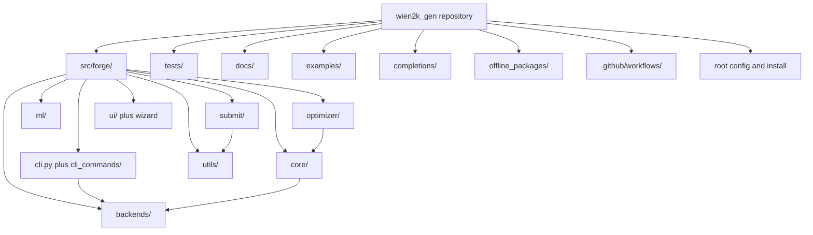

---

## 2. Root files

```mermaid
flowchart LR
    subgraph rootfiles["root"]
        A1["README.md"]
        A2["LICENSE.md"]
        A3["CITATION.cff"]
        A4["pyproject.toml"]
        A5["Makefile"]
        A6["install.sh"]
        A7["environment.yml"]
        A8["download_and_train.py"]
        A9["Dockerfile"]
        A10["docker-compose.yml"]
        A11[".dockerignore"]
        A12["Singularity.def"]
        A13[".gitignore"]
        A14[".pre-commit-config.yaml"]
        A15["parallel_options"]
    end
```

| File | Role |
|------|------|
| `README.md` | Project overview |
| `LICENSE.md` | MIT license |
| `CITATION.cff` | Citation metadata |
| `pyproject.toml` | Package, extras, entry points |
| `Makefile` | install, test, docker, completions |
| `install.sh` | Production installer |
| `environment.yml` | Conda environment |
| `download_and_train.py` | ML dataset / train helper |
| `Dockerfile` | multi-stage `runtime` / `dev` |
| `docker-compose.yml` | forge / dev / test services |
| `.dockerignore` | Docker build context filter |
| `Singularity.def` | Apptainer image |
| `.gitignore` | Git ignore rules |
| `.pre-commit-config.yaml` | pre-commit hooks |
| `parallel_options` | sample / generated WIEN2k options |

---

## 3. GitHub workflows

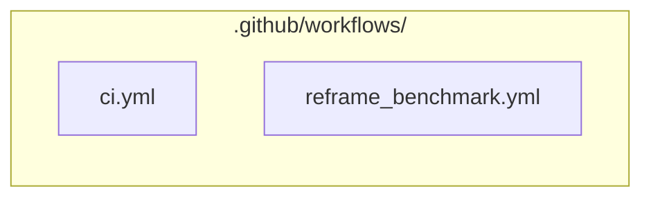

---

## 4. Completions

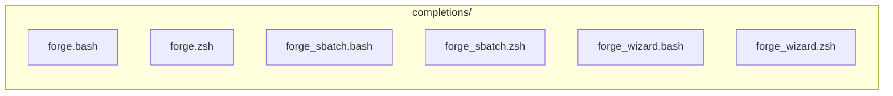

---

## 5. Documentation (`docs/`)

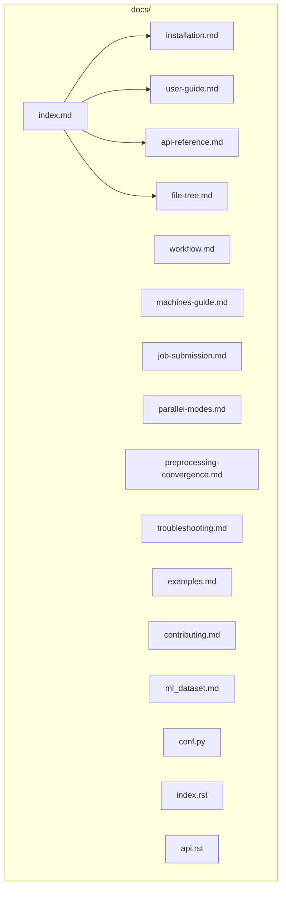

| File | Role |
|------|------|
| `index.md` | Docs home |
| `installation.md` | `install.sh`, source, Docker |
| `user-guide.md` | Every CLI flag with examples |
| `workflow.md` | `init_lapw` to submit |
| `machines-guide.md` | `.machines` generate / read |
| `job-submission.md` | four submit models |
| `parallel-modes.md` | kpoint / hybrid / mpi / fine_grain |
| `preprocessing-convergence.md` | RKmax, k-mesh, mixing |
| `troubleshooting.md` | errors and diagnostics |
| `examples.md` | scenario commands |
| `contributing.md` | development |
| `ml_dataset.md` | GNN / Bayesian / history |
| `api-reference.md` | Python API (do not casually edit) |
| `file-tree.md` | this diagram |
| `conf.py` | leftover Sphinx config |
| `index.rst` | stub pointing at Markdown |
| `api.rst` | stub pointing at `api-reference.md` |

---

## 6. Examples

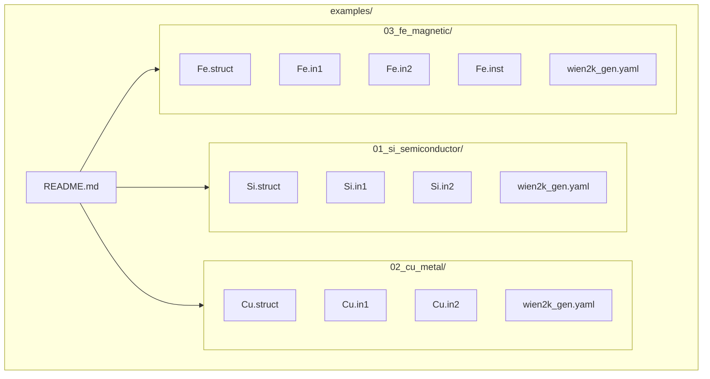

---

## 7. Offline wheels

```mermaid
flowchart TB
    subgraph off["offline_packages/"]
        O0["requirements-offline.txt"]
        subgraph wheels["packaging_offline/"]
            W1["PyYAML-6.0.1-cp39-...whl"]
            W2["linkify_it_py-2.0.3-py3-none-any.whl"]
            W3["markdown_it_py-3.0.0-py3-none-any.whl"]
            W4["mdit_py_plugins-0.4.2-py3-none-any.whl"]
            W5["mdurl-0.1.2-py3-none-any.whl"]
            W6["numpy-1.24.4-cp39-...whl"]
            W7["platformdirs-4.3.6-py3-none-any.whl"]
            W8["psutil-5.9.8-cp36-abi3-...whl"]
            W9["pygments-2.18.0-py3-none-any.whl"]
            W10["rich-13.7.1-py3-none-any.whl"]
            W11["textual-0.85.2-py3-none-any.whl"]
            W12["typing_extensions-4.12.2-py3-none-any.whl"]
            W13["uc_micro_py-1.0.3-py3-none-any.whl"]
        end
        O0 --> wheels
    end
```

Exact wheel filenames:

- `offline_packages/requirements-offline.txt`
- `offline_packages/packaging_offline/PyYAML-6.0.1-cp39-cp39-manylinux_2_17_x86_64.manylinux2014_x86_64.whl`
- `offline_packages/packaging_offline/linkify_it_py-2.0.3-py3-none-any.whl`
- `offline_packages/packaging_offline/markdown_it_py-3.0.0-py3-none-any.whl`
- `offline_packages/packaging_offline/mdit_py_plugins-0.4.2-py3-none-any.whl`
- `offline_packages/packaging_offline/mdurl-0.1.2-py3-none-any.whl`
- `offline_packages/packaging_offline/numpy-1.24.4-cp39-cp39-manylinux_2_17_x86_64.manylinux2014_x86_64.whl`
- `offline_packages/packaging_offline/platformdirs-4.3.6-py3-none-any.whl`
- `offline_packages/packaging_offline/psutil-5.9.8-cp36-abi3-manylinux_2_12_x86_64.manylinux2010_x86_64.manylinux_2_17_x86_64.manylinux2014_x86_64.whl`
- `offline_packages/packaging_offline/pygments-2.18.0-py3-none-any.whl`
- `offline_packages/packaging_offline/rich-13.7.1-py3-none-any.whl`
- `offline_packages/packaging_offline/textual-0.85.2-py3-none-any.whl`
- `offline_packages/packaging_offline/typing_extensions-4.12.2-py3-none-any.whl`
- `offline_packages/packaging_offline/uc_micro_py-1.0.3-py3-none-any.whl`

---

## 8. Package entry and CLI

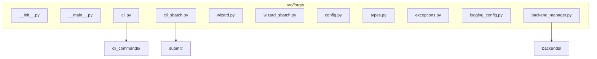

### `src/forge/cli_commands/`

```mermaid
flowchart LR
    subgraph cmds["cli_commands/"]
        Q0["__init__.py"]
        Q1["base.py"]
        Q2["_utils.py"]
        Q3["generate.py"]
        Q4["submit.py"]
        Q5["benchmark.py"]
        Q6["diagnostics.py"]
        Q7["hardware.py"]
        Q8["analyze.py"]
        Q9["tui.py"]
        Q10["monitor.py"]
        Q11["run.py"]
        Q12["workflow.py"]
        Q13["diagnose.py"]
        Q14["optimize.py"]
        Q15["screen.py"]
        Q16["predict.py"]
        Q17["advise.py"]
        Q18["converge.py"]
        Q19["history.py"]
        Q20["analyze_bands.py"]
        Q21["calibrate.py"]
    end
```

---

## 9. Backends

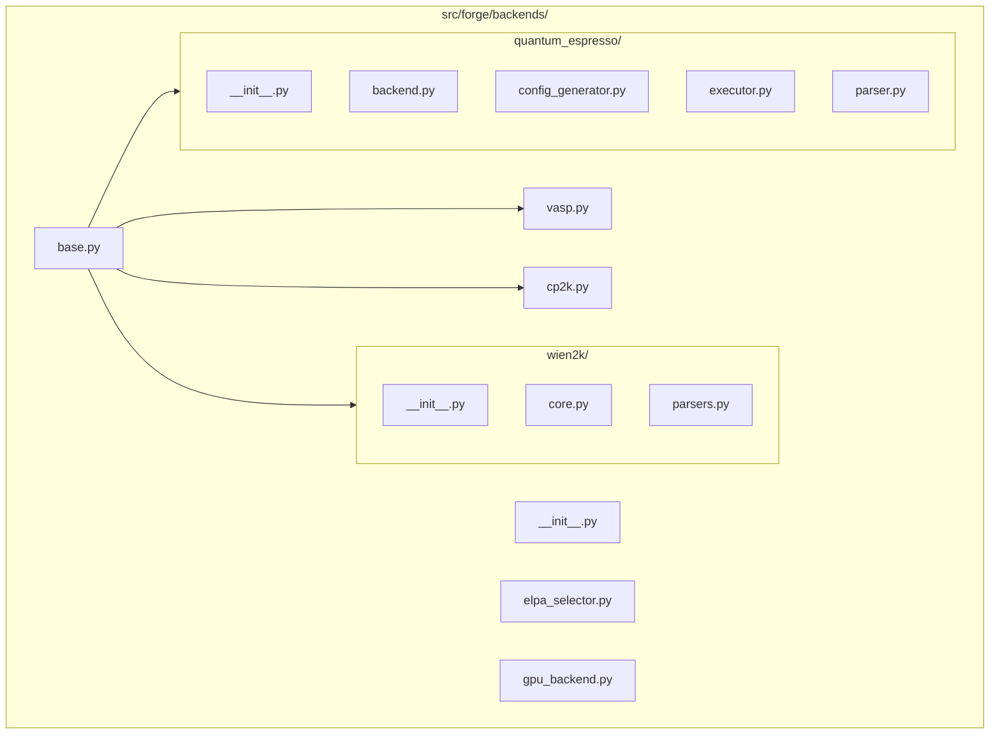

---

## 10. Core

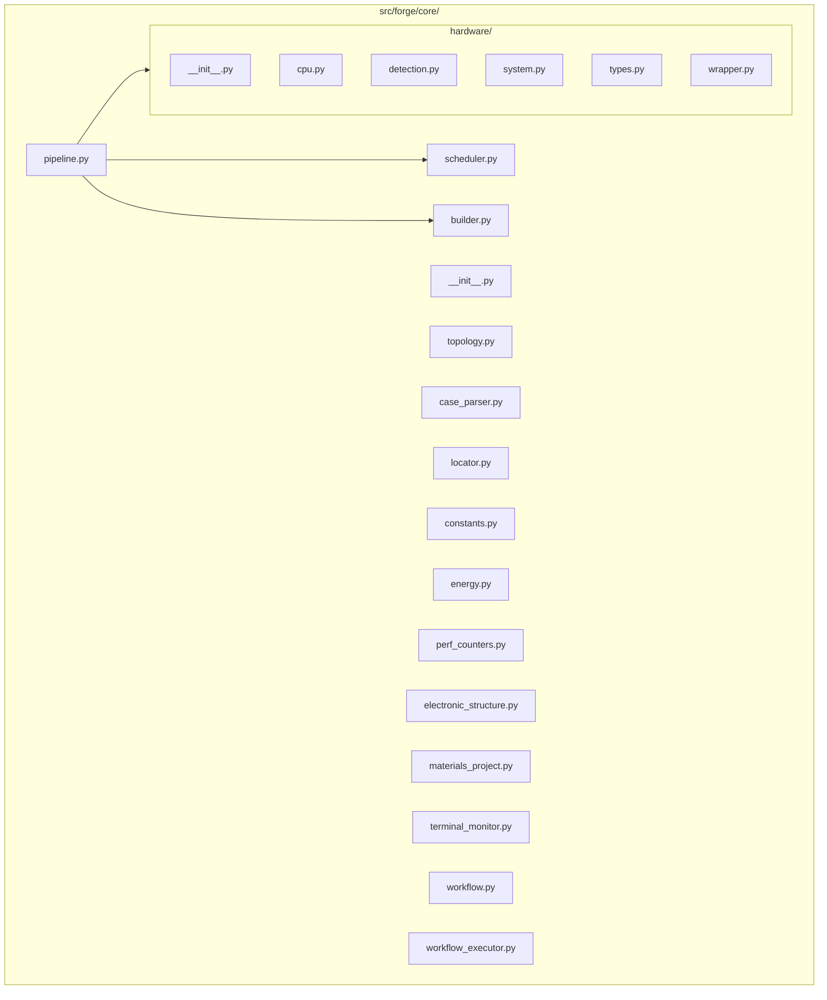

---

## 11. Optimizer, ML, submit, utils, UI, benchmark

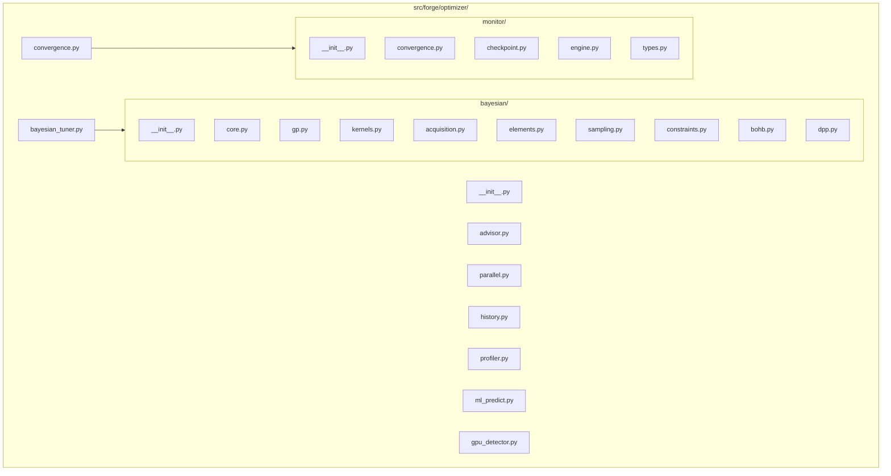

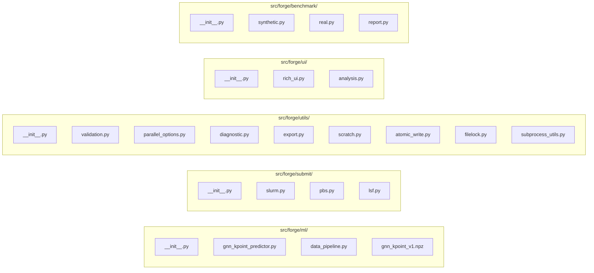

---

## 12. Tests

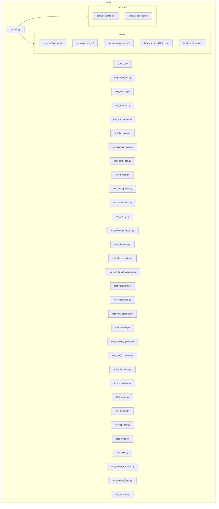

---

## 13. Full path inventory

Omitted as files: `__pycache__/**`, `.pytest_cache/**`, `*.pyc`, `src/forge.egg-info/**`, `.monkeycode-tmp-files/**`, `coverage.xml`.

```
.gitignore
.pre-commit-config.yaml
.dockerignore
.github/workflows/ci.yml
.github/workflows/reframe_benchmark.yml
CITATION.cff
Dockerfile
LICENSE.md
Makefile
README.md
Singularity.def
completions/forge.bash
completions/forge.zsh
completions/forge_sbatch.bash
completions/forge_sbatch.zsh
completions/forge_wizard.bash
completions/forge_wizard.zsh
docker-compose.yml
docs/api-reference.md
docs/api.rst
docs/conf.py
docs/contributing.md
docs/examples.md
docs/file-tree.md
docs/index.md
docs/index.rst
docs/installation.md
docs/job-submission.md
docs/machines-guide.md
docs/ml_dataset.md
docs/parallel-modes.md
docs/preprocessing-convergence.md
docs/troubleshooting.md
docs/user-guide.md
docs/workflow.md
download_and_train.py
environment.yml
examples/README.md
examples/01_si_semiconductor/Si.in1
examples/01_si_semiconductor/Si.in2
examples/01_si_semiconductor/Si.struct
examples/01_si_semiconductor/wien2k_gen.yaml
examples/02_cu_metal/Cu.in1
examples/02_cu_metal/Cu.in2
examples/02_cu_metal/Cu.struct
examples/02_cu_metal/wien2k_gen.yaml
examples/03_fe_magnetic/Fe.in1
examples/03_fe_magnetic/Fe.in2
examples/03_fe_magnetic/Fe.inst
examples/03_fe_magnetic/Fe.struct
examples/03_fe_magnetic/wien2k_gen.yaml
install.sh
offline_packages/requirements-offline.txt
offline_packages/packaging_offline/PyYAML-6.0.1-cp39-cp39-manylinux_2_17_x86_64.manylinux2014_x86_64.whl
offline_packages/packaging_offline/linkify_it_py-2.0.3-py3-none-any.whl
offline_packages/packaging_offline/markdown_it_py-3.0.0-py3-none-any.whl
offline_packages/packaging_offline/mdit_py_plugins-0.4.2-py3-none-any.whl
offline_packages/packaging_offline/mdurl-0.1.2-py3-none-any.whl
offline_packages/packaging_offline/numpy-1.24.4-cp39-cp39-manylinux_2_17_x86_64.manylinux2014_x86_64.whl
offline_packages/packaging_offline/platformdirs-4.3.6-py3-none-any.whl
offline_packages/packaging_offline/psutil-5.9.8-cp36-abi3-manylinux_2_12_x86_64.manylinux2010_x86_64.manylinux_2_17_x86_64.manylinux2014_x86_64.whl
offline_packages/packaging_offline/pygments-2.18.0-py3-none-any.whl
offline_packages/packaging_offline/rich-13.7.1-py3-none-any.whl
offline_packages/packaging_offline/textual-0.85.2-py3-none-any.whl
offline_packages/packaging_offline/typing_extensions-4.12.2-py3-none-any.whl
offline_packages/packaging_offline/uc_micro_py-1.0.3-py3-none-any.whl
parallel_options
pyproject.toml
src/forge/__init__.py
src/forge/__main__.py
src/forge/backend_manager.py
src/forge/backends/__init__.py
src/forge/backends/base.py
src/forge/backends/cp2k.py
src/forge/backends/elpa_selector.py
src/forge/backends/gpu_backend.py
src/forge/backends/quantum_espresso/__init__.py
src/forge/backends/quantum_espresso/backend.py
src/forge/backends/quantum_espresso/config_generator.py
src/forge/backends/quantum_espresso/executor.py
src/forge/backends/quantum_espresso/parser.py
src/forge/backends/vasp.py
src/forge/backends/wien2k/__init__.py
src/forge/backends/wien2k/core.py
src/forge/backends/wien2k/parsers.py
src/forge/benchmark/__init__.py
src/forge/benchmark/real.py
src/forge/benchmark/report.py
src/forge/benchmark/synthetic.py
src/forge/cli.py
src/forge/cli_commands/__init__.py
src/forge/cli_commands/_utils.py
src/forge/cli_commands/advise.py
src/forge/cli_commands/analyze.py
src/forge/cli_commands/analyze_bands.py
src/forge/cli_commands/base.py
src/forge/cli_commands/benchmark.py
src/forge/cli_commands/calibrate.py
src/forge/cli_commands/converge.py
src/forge/cli_commands/diagnose.py
src/forge/cli_commands/diagnostics.py
src/forge/cli_commands/generate.py
src/forge/cli_commands/hardware.py
src/forge/cli_commands/history.py
src/forge/cli_commands/monitor.py
src/forge/cli_commands/optimize.py
src/forge/cli_commands/predict.py
src/forge/cli_commands/run.py
src/forge/cli_commands/screen.py
src/forge/cli_commands/submit.py
src/forge/cli_commands/tui.py
src/forge/cli_commands/workflow.py
src/forge/cli_sbatch.py
src/forge/config.py
src/forge/core/__init__.py
src/forge/core/builder.py
src/forge/core/case_parser.py
src/forge/core/constants.py
src/forge/core/electronic_structure.py
src/forge/core/energy.py
src/forge/core/hardware/__init__.py
src/forge/core/hardware/cpu.py
src/forge/core/hardware/detection.py
src/forge/core/hardware/system.py
src/forge/core/hardware/types.py
src/forge/core/hardware/wrapper.py
src/forge/core/locator.py
src/forge/core/materials_project.py
src/forge/core/perf_counters.py
src/forge/core/pipeline.py
src/forge/core/scheduler.py
src/forge/core/terminal_monitor.py
src/forge/core/topology.py
src/forge/core/workflow.py
src/forge/core/workflow_executor.py
src/forge/exceptions.py
src/forge/logging_config.py
src/forge/ml/__init__.py
src/forge/ml/data_pipeline.py
src/forge/ml/gnn_kpoint_predictor.py
src/forge/ml/gnn_kpoint_v1.npz
src/forge/optimizer/__init__.py
src/forge/optimizer/advisor.py
src/forge/optimizer/bayesian/__init__.py
src/forge/optimizer/bayesian/acquisition.py
src/forge/optimizer/bayesian/bohb.py
src/forge/optimizer/bayesian/constraints.py
src/forge/optimizer/bayesian/core.py
src/forge/optimizer/bayesian/dpp.py
src/forge/optimizer/bayesian/elements.py
src/forge/optimizer/bayesian/gp.py
src/forge/optimizer/bayesian/kernels.py
src/forge/optimizer/bayesian/sampling.py
src/forge/optimizer/bayesian_tuner.py
src/forge/optimizer/convergence.py
src/forge/optimizer/gpu_detector.py
src/forge/optimizer/history.py
src/forge/optimizer/ml_predict.py
src/forge/optimizer/monitor/__init__.py
src/forge/optimizer/monitor/checkpoint.py
src/forge/optimizer/monitor/convergence.py
src/forge/optimizer/monitor/engine.py
src/forge/optimizer/monitor/types.py
src/forge/optimizer/parallel.py
src/forge/optimizer/profiler.py
src/forge/submit/__init__.py
src/forge/submit/lsf.py
src/forge/submit/pbs.py
src/forge/submit/slurm.py
src/forge/types.py
src/forge/ui/__init__.py
src/forge/ui/analysis.py
src/forge/ui/rich_ui.py
src/forge/utils/__init__.py
src/forge/utils/atomic_write.py
src/forge/utils/diagnostic.py
src/forge/utils/export.py
src/forge/utils/filelock.py
src/forge/utils/parallel_options.py
src/forge/utils/scratch.py
src/forge/utils/subprocess_utils.py
src/forge/utils/validation.py
src/forge/wizard.py
src/forge/wizard_sbatch.py
tests/__init__.py
tests/conftest.py
tests/fixtures/case_minimal.struct
tests/fixtures/hardware_avx512_ib.json
tests/fixtures/scf_converged.scf
tests/fixtures/scf_not_converged.scf
tests/fixtures/topology_slurm.json
tests/integration_test.py
tests/reframe/reframe_config.py
tests/reframe/wien2k_gen_test.py
tests/test_advisor.py
tests/test_analysis.py
tests/test_auto_detect.py
tests/test_bayesian.py
tests/test_bayesian_core.py
tests/test_bohb_dpp.py
tests/test_builder.py
tests/test_case_parser.py
tests/test_completions.py
tests/test_config.py
tests/test_convergence_opt.py
tests/test_diagnose.py
tests/test_elpa_selector.py
tests/test_gnn_kpoint_predictor.py
tests/test_hardware.py
tests/test_integration.py
tests/test_new_features.py
tests/test_parallel.py
tests/test_parallel_options.py
tests/test_perf_counters.py
tests/test_robustness.py
tests/test_scheduler.py
tests/test_slurm.py
tests/test_submit.py
tests/test_topology.py
tests/test_types.py
tests/test_utils.py
tests/test_wien2k_backend.py
tests/test_wien2k_flags.py
tests/test_wizard.py
```
